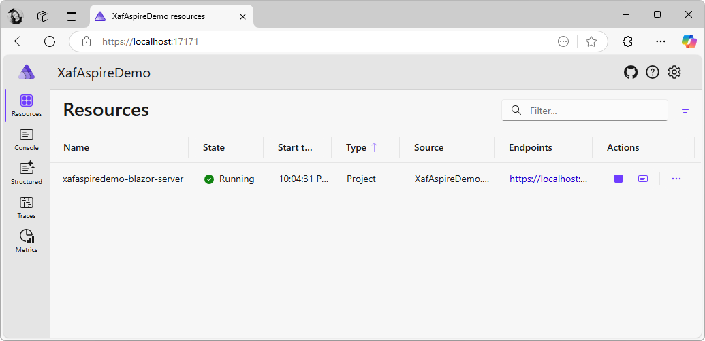

<!-- default badges list -->

<!-- default badges end -->
# XAF - Add .NET Aspire to an XAF Blazor Project

[.NET Aspire](https://learn.microsoft.com/en-us/dotnet/aspire/get-started/aspire-overview) is a collection of tools, templates, and packages for developing observable, production-ready applications. You can integrate .NET Aspire into your XAF Blazor application to utilize its orchestration features. 

This example adds Aspire functionality to the application and serves as a practical implementation of the actions described in the following blog post: [.NET Aspire Support For An XAF Blazor Project](https://community.devexpress.com/blogs/news/archive/2025/03/20/net-aspire-support-for-an-xaf-blazor-project.aspx)

## Files to Review

- [DataItem.cs](CS/XafAspireDemo.Module/BusinessObjects/DataItem.cs)
- [Extensions.cs](CS/XafAspireDemo.ServiceDefaults/Extensions.cs)
- [Startup.cs](CS/XafAspireDemo.Blazor.Server/Startup.cs)
- [Program.cs](CS/XafAspireDemo.Blazor.Server/Program.cs)

<!-- feedback -->
## Does this example address your development requirements/objectives?

 

(you will be redirected to DevExpress.com to submit your response)
<!-- feedback end -->
